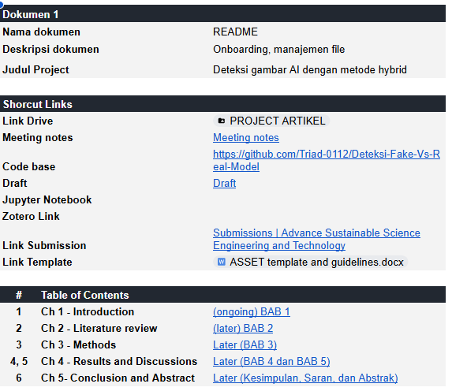
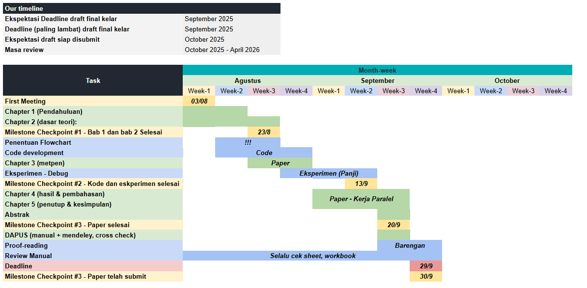

This fake image detection research is a collaborative effort between me and my online friend, Panji. He approached me on July 29th, 2025, explaining that he wanted to collaborate on doing research in Computer Vision, particularly Fake Image detection. At that time, I initially wanted to refuse since I had never heard or read any papers about this topic, and I wanted to focus on preparing my materials for my master's. However, I thought that I should challenge myself by exploring new topics, especially if that topic intersects with my interests.

As I agreed to pull this project together with him, I offered myself to create a spreadsheet dashboard to monitor our progress and to store our literature review and our draft. Also, because I highly value the spirit of 'open-source' all of my projects, anyone who wants the template can ask me through [this email](mailto:khalilullah.alfaath21@gmail.com?subject=Asking%20for%20the%20research%20project%20dashboard%20template&body=Hi%2C%20I%20am%20from%20your%20blog%20asking%20for%20the%20research%20dashboard%20template.%20Thank%20you). 

From the picture, we can see that I have ordered this spreadsheet based on the timeline of this project. There are at least 10 pages with different functions. Here are the details:

* README, for onboarding and file management;
* Meeting notes, to record my meeting topics, dates, discussions or decisions, PIC, status, deadline date, and additional notes;
* Timeline, it's more like a Gantt chart wannabe;

* List of resources, to store all the resources that I got, like papers, datasets, repositories, videos, etc..
* Paper review, to store all papers that are already reviewed, I have to fill several fields, like the title, link, strengths and weaknesses, dataset being used, performance, etc..
* The rest are pages containing separate drafts organised by sections. These sections are organised based on questions and answers, for example, in introduction section for my first few sentences, I have to answer "What is the background of this project?"
