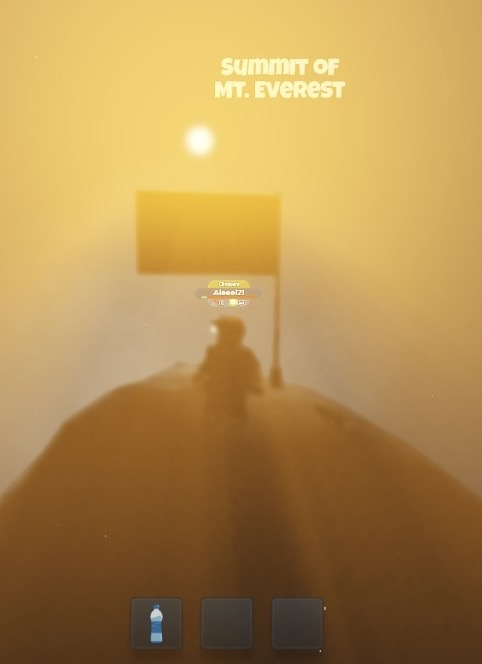
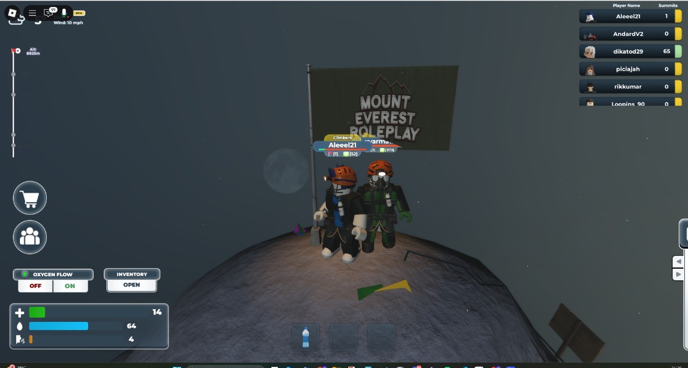

Setelah berkali-kali terjatuh dan berkali-kali gagal, hari ini, 20 Juli 2025, aku berdiri di puncak dunia, Mount Everest di Roblox yang telah kutaklukkan. 

*Fuck the doubters!*

Aku memulai perjalanan ini sendirian. Tidak ada pemandu, tidak ada tim, hanya aku dan tekad yang tak bisa digadaikan. Menelusuri geyser yang panjang, menggigil mendaki gunung es yang sunyi dan kejam, hingga melintasi jembatan sempit yang menggantung bagai neraka kecil di langit, tetapi aku tak pernah gentar.

Aku melihat banyak grup yang kompak, pasangan yang saling menyemangati, dan sekumpulan sahabat yang tertawa di sepanjang jalan. Aku tidak iri. Tidak butuh keramaian untuk membuktikan siapa diriku. Hanya langkah kaki dan kehendakku-lah yang terus membara.

Tangki oksigenku terus menipis, embusan napas terasa semakin berat. Setiap detik adalah duel antara hidup dan mati. Tapi aku belajar: panik tak menyelamatkan nyawa. Ketelitian dan observasi lah yang menyelamatkanku.

Aku nyaris mati, jatuh dari tangga besi vertikal yang kejam itu, tempat banyak pendaki lain kehilangan nyawa. Tubuhku menghantam batu, darah digital memercik, *health point*-ku tersisa 25. Tapi aku bangkit. Mungkin ini bukan kebetulan. Mungkin ini adalah panggilan dari takdir: bahwa aku harus sampai ke puncak.

Dan kini aku di sini.

Di titik tertinggi Mount Everest. Bukan sekadar menaklukkan medan, tapi menaklukkan rasa takut, kesepian, dan keraguan. Ini adalah kemenangan untuk mereka yang terus melangkah saat semua orang memilih menyerah.

Hari ini, aku menaklukkan Everest. Bukan karena kuat, tapi karena aku menolak untuk berhenti.

