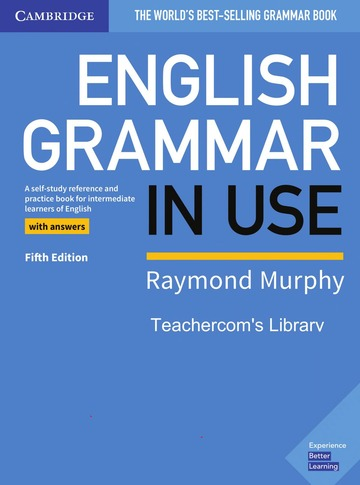

I began my journey of learning how to write specifically for the IELTS writing section in 2024. At first, I thought that maybe I should start by focusing on grammar, as I had never truly understood it. Even the basics felt shaky once I tried to recall them -- Blame Indonesia's national curriculum for this :D For example, when it came to tenses, I only knew the simple present, present continuous, and simple past. Realising this was, frankly, embarrassing. 

The problem was, I did not know where to learn. I asked myself, "Should I use books, take an online course, watch YouTube tutorials, or something else?" While searching for recommendations online, I came across this book called ***English Grammar in Use***, which, apparently, has long been considered the best grammar book out there. It seemed like a good place to start, so I thought, why not give it a try?

